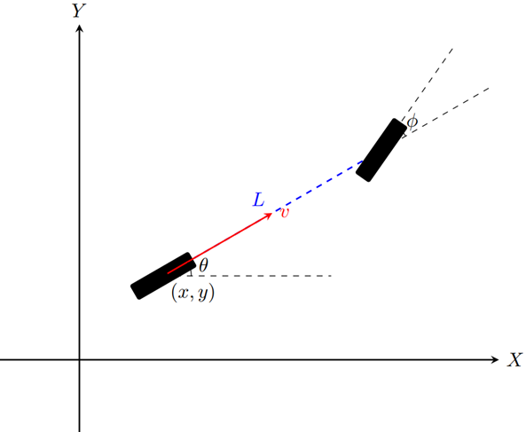

  
  

    <h3 class="mb-4">Obiettivo del progetto</h3>
    

      L'obiettivo principale di questo lavoro di tesi è stato progettare e implementare un sistema di <strong>Model Predictive Control (MPC)</strong> capace di superare i limiti della modellistica matematica classica, integrandola con approcci <em>data-driven</em>.
    

    <h3 class="mt-5 mb-4">Metodologia e tecnologie</h3>
    
Per gestire dinamiche complesse e non lineari, ho affiancato la teoria del controllo ottimo all'utilizzo di <strong>Reti neurali</strong>. L'architettura sviluppata permette al sistema di:

    
    <ul class="list-group list-group-flush mb-4">
      <li class="list-group-item bg-transparent border-0 pl-0"><i class="fas fa-check-circle text-primary mr-2"></i> Apprendere il comportamento dinamico dell'impianto direttamente dai dati storici.</li>
      <li class="list-group-item bg-transparent border-0 pl-0"><i class="fas fa-check-circle text-primary mr-2"></i> Poter ricostruire la funzione di costo associata al modello per il task d'inseguimento asintotico</li>
      <li class="list-group-item bg-transparent border-0 pl-0"><i class="fas fa-check-circle text-primary mr-2"></i> Calcolare l'azione di controllo ottima garantendo stabilità e rispetto dei vincoli.</li>
    </ul>

    <h3 class="mt-5 mb-4">Applicazioni pratiche</h3>
    

    La soluzione sviluppata è pensata per essere scalabile e applicabile a progetti industriali concreti, dovremmo però effettuare una pre-analisi per analizzare l'efficienza del controllo su un modello reale.
    

  

  

    
    
    
    

      

        <h5 class="card-title mb-4">Documentazione</h5>
        <a href="../tesi-mpc-digiamberardino.pdf" class="btn btn-primary btn-block mb-3" target="_blank">
          <i class="fas fa-file-pdf mr-2"></i> Scarica la Tesi
        </a>
        <a href="../presentazione-mpc.pptx" class="btn btn-outline-primary btn-block" target="_blank">
          <i class="fas fa-file-powerpoint mr-2"></i> Presentazione
        </a>
      

    

  

