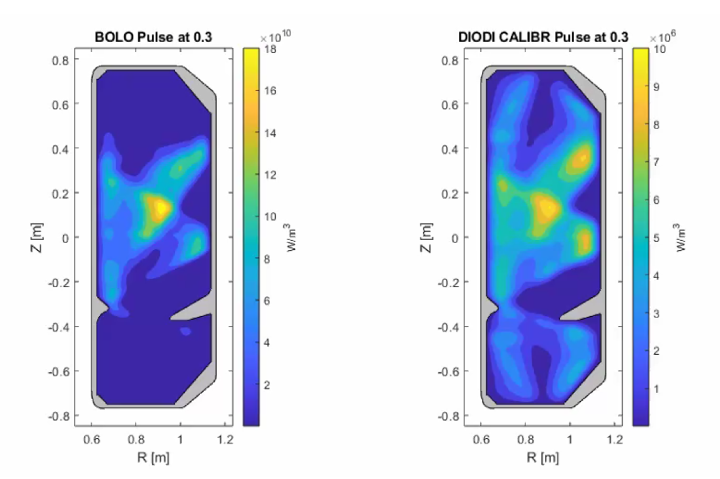

  
  

    <h3 class="mb-4">Contesto Operativo</h3>
    

      Nel controllo del plasma all'interno dei reattori <strong>Tokamak</strong>, il monitoraggio della potenza dissipata è cruciale. I sensori tradizionali (bolometri) hanno tempi di risposta troppo lenti (millisecondi) per rilevare dinamiche instabili veloci come gli <strong>ELMs</strong>. I diodi AXUV risolvono il problema della velocità (microsecondi), ma presentano lo svantaggio di non poter essere calibrati in maniera assoluta.
    

    <h3 class="mt-5 mb-4">La Soluzione Algoritmica</h3>
    
Per superare questo limite hardware, ho contribuito allo sviluppo di un modello di calibrazione lineare iterativo basato sull'algoritmo di ottimizzazione <strong>RLS (Recursive Least Squares)</strong>. Il lavoro si è articolato in diverse fasi:

    
    <ul class="list-group list-group-flush mb-4">
      <li class="list-group-item bg-transparent border-0 pl-0"><i class="fas fa-filter text-primary mr-2"></i> <strong>Data Pre-processing:</strong> Filtraggio del rumore e interpolazione spaziale/temporale per mitigare le misurazioni errate derivanti da Linee di Vista (LOS) malfunzionanti (mostrate nello schema a destra).</li>
      <li class="list-group-item bg-transparent border-0 pl-0"><i class="fas fa-sync text-primary mr-2"></i> <strong>Stima Adattiva (RLS):</strong> Implementazione dell'aggiornamento iterativo della stima dei parametri, della matrice di covarianza (incertezza) e del guadagno.</li>
      <li class="list-group-item bg-transparent border-0 pl-0"><i class="fas fa-chart-area text-primary mr-2"></i> <strong>Cross-Calibration:</strong> Utilizzo dell'emissività ricostruita dai bolometri come riferimento base per calibrare dinamicamente le misure dei diodi AXUV ad alta frequenza.</li>
    </ul>
  

  

    
    
    

       <i class="fas fa-bolt fa-3x text-secondary mb-3"></i>
       <h5 class="text-muted">Risultati Ottenuti</h5>
       
La calibrazione ha permesso ai diodi AXUV di ricostruire con successo i picchi di instabilità veloce (ELMs) che i bolometri non riuscivano a rilevare per via della loro limitata risoluzione temporale, garantendo un'ottima ricostruzione dell'emissività.

       
       <a href="../Tesina_Cross_Calibration.pptx" class="btn btn-outline-primary btn-sm"><i class="fas fa-file-powerpoint mr-2"></i> Presentazione Progetto</a>
    

  

