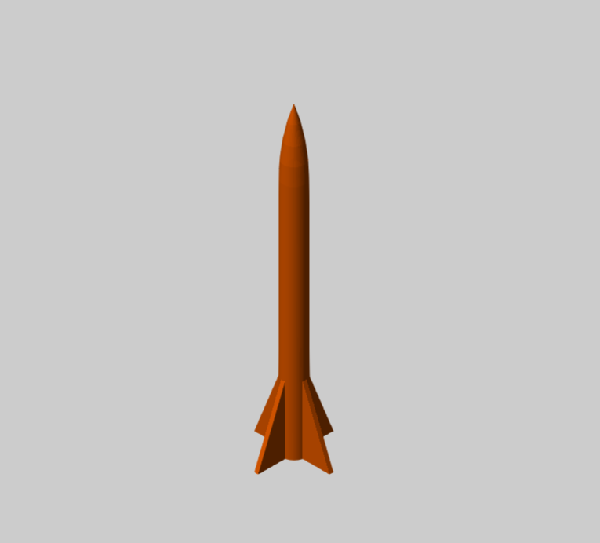

  

    <h3 class="mb-4">Il progetto e la sfida 🚀</h3>
    

      La stabilizzazione di un razzo in volo è un classico problema di controllo, reso estremamente complesso dalle dinamiche aerospaziali e dalle repentine variazioni di massa. Questo progetto personale, attualmente in fase di sviluppo, punta a implementare il sistema di controllo per l'assetto di un modello di razzo (OpenRocket). 
    

    <h3 class="mt-5 mb-4">Sviluppo e chiusura dell'anello</h3>
    
Partendo da un accurato modello fisico matematico <em>open-loop</em> (sviluppato e ispirato dalla community aerospaziale BPS.space), il mio lavoro si sta concentrando sulla progettazione della retroazione:

    
    <ul class="list-group list-group-flush mb-4">
      <li class="list-group-item bg-transparent border-0 pl-0"><i class="fas fa-rocket text-primary mr-2"></i> <strong>Dinamica: </strong> Sfruttamento del modello fisico implementato tramite Simscape che tiene conto di massa, momenti d'inerzia e risoluzione trigonometrica dei vettori di spinta.</li>
      <li class="list-group-item bg-transparent border-0 pl-0"><i class="fas fa-project-diagram text-primary mr-2"></i> <strong>Sviluppo closed-loop:</strong> L'architettura di controllo è caratterizzata dall'uso di <strong> controllori PID indipendenti </strong> nello specifico utilizzo un blocco main in cui implemento tre PID control per definire la Fz_des, Fx_des e la Fy_des, questo mi permette di determinare a sua volta il Trust_Vector e gli angoli theta_des(pitch), psi_des(yaw) che vengono passati ad altri blocchi di controllo, i quali generano il gimbalangle_pitch/_yaw (In ogni blocco sono state implementate saturazioni coerenti con la fisica reale del razzo).</li>
      <li class="list-group-item bg-transparent border-0 pl-0"><i class="fas fa-robot text-primary mr-2"></i> <strong>Planner Block:</strong> Utilizzo di un planner block per gestire il piano di volo basato sul polinomio quintico.</li>
    </ul>
  

  

    
    
    <video class="w-100 rounded shadow-sm mb-4" autoplay loop muted playsinline controls>
      <source src="../rocket_fly_test.mp4" type="video/mp4">
      Il tuo browser non supporta il tag video.
    </video>
    
    

       <i class="fas fa-tools fa-3x text-warning mb-3"></i>
       <h5 class="text-muted">Work in Progress</h5>
       
Il modello Simulink è in fase di calibrazione e ottimizzazione del PID. Ritengo che lavorare a progetti personali extra-curriculari e affrontare le difficoltà della sintonizzazione (tuning) su sistemi non lineari sia il modo migliore per rafforzare le proprie competenze ingegneristiche sul campo.

    

  

